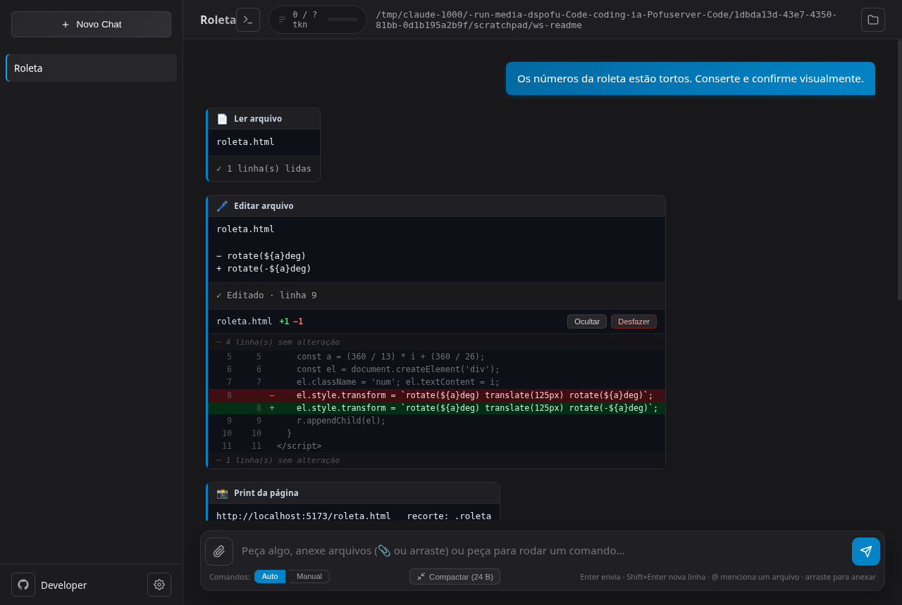
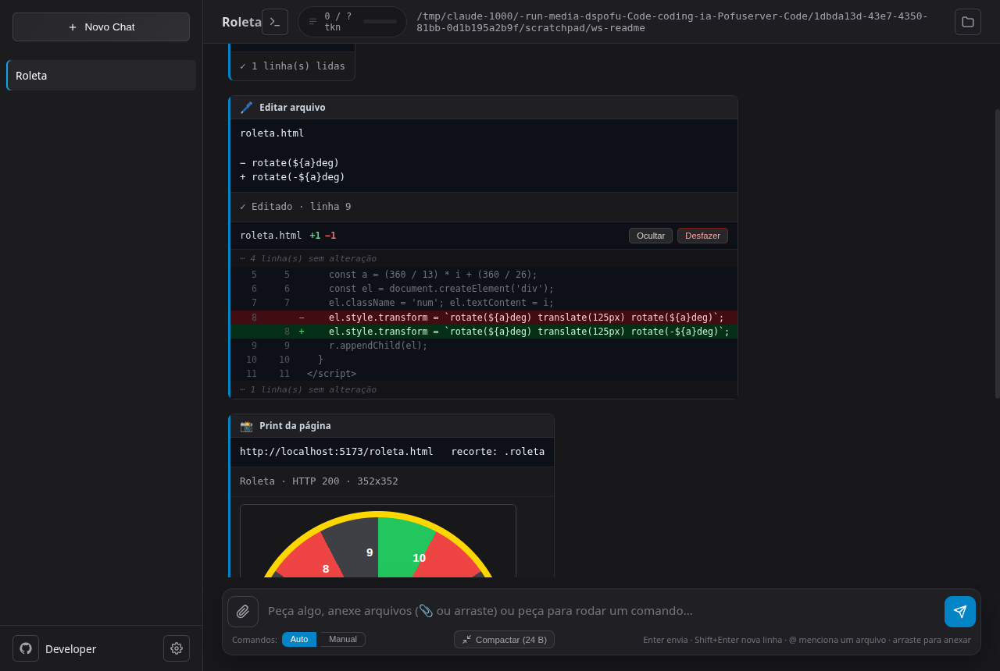
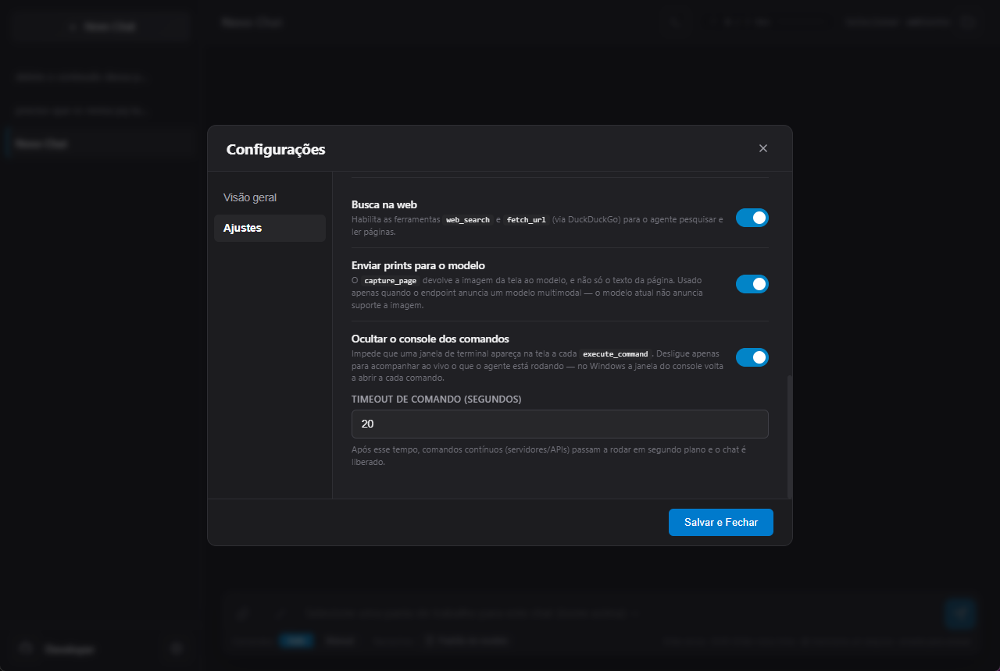
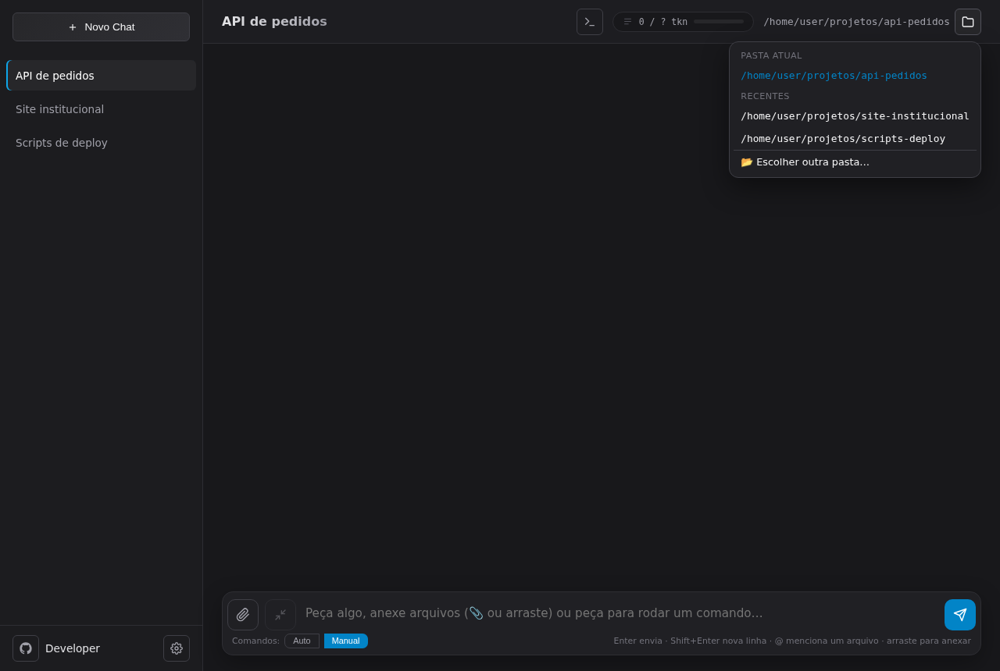
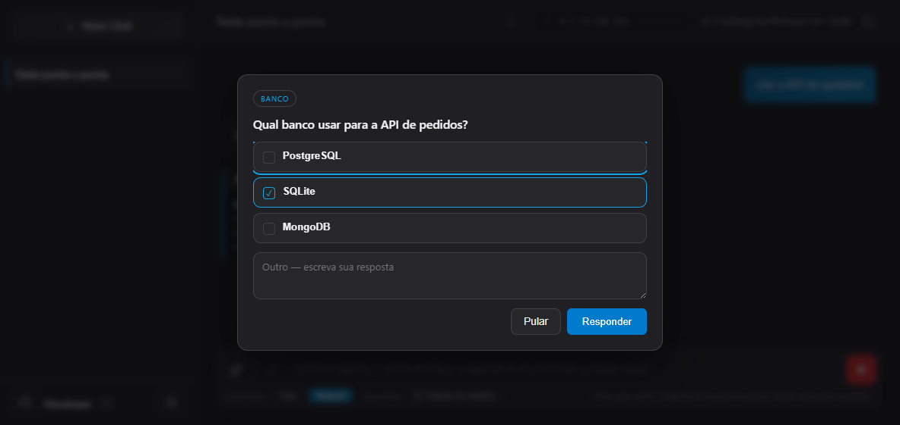
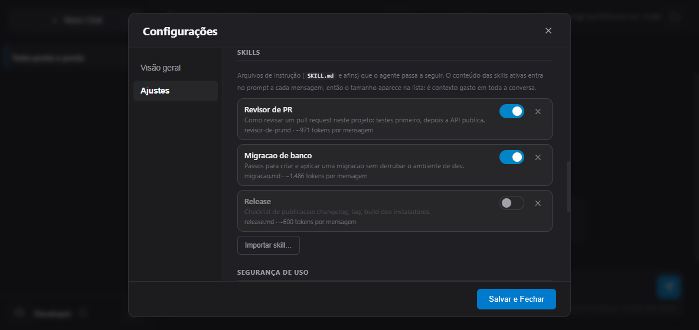
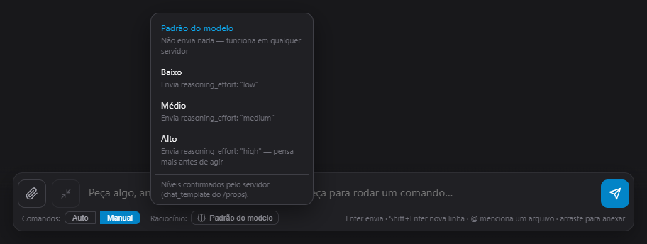

<!-- SPDX-License-Identifier: Apache-2.0 -->
<!-- Copyright 2026-present the Pofu Code Studio authors. All rights reserved. -->

# Pofu Code Studio

**Agente de código em desktop** (Electron) que se conecta a **qualquer API REST compatível com OpenAI** — [llama.cpp](https://github.com/ggml-org/llama.cpp), [Ollama](https://ollama.com/), [vLLM](https://github.com/vllm-project/vllm) — e trabalha direto nos arquivos do seu projeto: lê, edita, busca, roda comandos, chama APIs e **tira print das páginas que constrói**.

Um "Cursor/Claude Code" local, rodando com o **seu** modelo, na **sua** máquina.



---

## Demonstração

O pedido foi: *"os números da roleta estão tortos, conserte e confirme visualmente"*. Sem sair do chat, o agente:

1. **Leu** o arquivo e localizou o cálculo do posicionamento;
2. **Recortou o print** só na roleta (`crop_selector`), porque defeito de alinhamento some quando a imagem da página inteira é reduzida;
3. **Viu** que cada número girava junto com o setor — a segunda rotação estava no mesmo sentido da primeira;
4. **Editou uma linha** com `edit_file`, preservando o resto do arquivo;
5. **Capturou de novo** e comparou antes/depois.

Toda alteração vira um **diff revisável com botão de desfazer**:



---

## Funcionalidades

### Ferramentas do agente

| Ferramenta | O que faz |
|---|---|
| `list_files` | Lista arquivos e pastas (com tamanho) |
| `read_file` | Lê em janelas de linhas, com paginação por `offset` |
| `write_file` | Cria um arquivo, ou sobrescreve um que já foi lido |
| `edit_file` | **Troca um trecho exato** — a forma padrão de alterar arquivo existente |
| `search_files` | Busca por texto/regex no projeto, com filtro glob |
| `ask_user` | **Faz uma pergunta e espera a resposta**, em card com opções clicáveis |
| `create_directory` / `delete_file` | Cria pasta / apaga arquivo |
| `execute_command` | Roda comando no workspace; servidores vão para segundo plano |
| `wait_for_process` | **Espera** um processo demorado terminar e devolve o exit code |
| `read_process_output` / `list_processes` / `stop_process` | Acompanha e encerra processos |
| `http_request` | Chama uma API e devolve status, cabeçalhos e corpo separados |
| `capture_page` | Abre a URL num navegador oculto, tira print e reporta erros de console e de rede |
| `web_search` / `fetch_url` | Busca na web e leitura de páginas (opcional, em *Ajustes → Ferramentas*) |

### Diff e desfazer
Cada escrita, edição ou remoção mostra **o que exatamente mudou** — colorido, numerado nas duas versões e com o contexto em volta — e um botão **Desfazer** que reverte o arquivo no disco. O desfazer também pode ser desfeito.

### O agente enxerga o que constrói
`capture_page` renderiza a página num navegador oculto e devolve o print. Com um modelo **multimodal**, a imagem volta para o modelo: ele descreve o que apareceu e compara com o esperado, em vez de deduzir pelo código. Use `full_page` para a página inteira e `crop_selector` para conferir detalhe em tamanho cheio.

### Validação de verdade
O prompt exige evidência: teste executado, exit code lido, resposta HTTP conferida ou print observado. "Escrevi o arquivo" não conta como validação, e o que não pôde ser verificado é declarado como não verificado. As instruções e as descrições das ferramentas são escritas **em inglês** — é a língua em que os modelos foram treinados a seguir instrução e a chamar ferramenta —, e o agente responde **na língua em que você escrever**.

### Contexto que não estoura
O histórico é compactado automaticamente quando se aproxima do limite do modelo: resultados antigos de ferramenta passam a ir encurtados **no envio**, e continuam completos na tela. O botão **Compactar**, ao lado do campo de texto, libera contexto na hora.

### Processos sem travar o chat
Servidores e watchers são detectados (por padrão de log ou ociosidade) e vão para segundo plano com PID. Tarefas demoradas são aguardadas com `wait_for_process`, numa chamada só.

### Falar com o agente no meio da resposta
O campo de texto continua **liberado enquanto o agente trabalha**. O que você escrever entra numa fila, aparece como chip acima do compositor e é entregue ao modelo na **próxima virada de turno** — logo depois da ferramenta em execução terminar, sem abortar nada. Dá para corrigir o rumo (*"na verdade usa outra pasta"*) sem esperar o fim nem perder o que já foi feito.

Com o campo vazio o botão volta a ser **parar**; com algo escrito ele manda para a fila. Um chip pode ser retirado da fila enquanto não foi entregue, e uma mensagem nova reinicia a trava de iterações — o limite existe para barrar o agente em looping sozinho, não a conversa que você está conduzindo.

### Progresso enquanto o arquivo é escrito
Escrever um arquivo grande é a parte mais demorada de um turno, e é justamente quando **nada** chegava à tela: o texto da resposta já tinha acabado, o resultado da ferramenta ainda não existia. Dezenas de segundos parados, indistinguíveis de um travamento.

Agora o card da ferramenta aparece assim que o modelo começa a ditar a chamada e mostra o andamento — arquivo de destino, linhas e bytes já recebidos, e as últimas linhas do que está sendo escrito. O título da janela acompanha (*"escrever arquivo: src/x.ts"*), e o mesmo card vira o card definitivo quando a chamada termina.

### Erros que dizem o que fazer
Falha de conexão, chave inválida, modelo inexistente e erro do servidor viram mensagens com causa e passos — não uma exceção crua. Só falha transitória é repetida.



### Pasta segura com troca rápida
Cada chat trabalha dentro de **uma pasta** — o agente não enxerga nada fora dela. O botão de pasta no cabeçalho abre um menu com a **pasta atual**, as **usadas recentemente** e a opção de escolher outra: alternar entre projetos é um clique, sem passar pelo diálogo do sistema toda vez.



### O agente pergunta quando trava de verdade

Quando o pedido tem duas leituras que levam a trabalhos diferentes, o agente para e **pergunta**, em vez de escolher no escuro e refazer depois:



O card mostra as opções que o modelo propôs; dá para marcar uma (ou várias, quando ele pede), escrever uma resposta própria no campo de texto, ou **Pular**. Pular é uma resposta válida: o agente decide sozinho e diz qual suposição adotou, em vez de ficar preso. O turno fica parado até você responder, e o **Parar** fecha o card junto com o resto.

A ferramenta é `ask_user`, e as instruções pedem que ela seja usada com parcimônia — só quando a resposta muda o trabalho, nunca para o que dá para descobrir lendo o projeto, e sempre depois de já ter feito tudo que não dependia da resposta.

### Instruções suas e skills

Em *Ajustes → Instruções do agente* há um campo de **system prompt**: o que você escrever ali entra no prompt em toda mensagem, valendo para regras do projeto (*"aqui é pnpm, não npm"*) e preferências de trabalho. Por padrão o texto é **somado** às instruções de fábrica; o interruptor *Substituir o prompt padrão* descarta as de fábrica e deixa só o seu texto — inclusive as regras de ler antes de sobrescrever e de validar antes de dizer que terminou, então é escolha para quem vai reescrever esse comportamento.

Logo abaixo ficam as **skills**: arquivos de instrução (o `SKILL.md` do Claude Code e parecidos) que você importa e liga por chave.



O `name` e o `description` saem do frontmatter YAML quando existe; sem frontmatter, o app usa o título `#` do arquivo e a primeira linha de texto. Reimportar o mesmo arquivo **atualiza** a skill em vez de duplicar, que é o fluxo de quem está escrevendo uma. Cada linha mostra o custo em tokens **por mensagem**, porque é isso que uma skill ativa é: conteúdo somado ao prompt em toda requisição — não um anexo que se lê uma vez. Skill desligada não entra no prompt.

### Nível de raciocínio no próprio compositor
O seletor **Raciocínio** fica ao lado do campo de mensagem, junto do Auto/Manual — quanto o modelo deve pensar é decisão que se toma na hora de escrever o pedido, não algo para lembrar dentro de um modal com a resposta já em andamento. Um clique abre os níveis, cada um com o que ele exige do servidor:



| Nível | O que é enviado | Aparece quando |
|---|---|---|
| Padrão do modelo | nada — funciona em qualquer servidor | sempre |
| Desligado | `enable_thinking: false` + `/no_think` no prompt | o servidor anuncia raciocínio ligável |
| Baixo / Médio / Alto / Máximo | `reasoning_effort: low \| medium \| high \| max` | o servidor anuncia `reasoning_effort` |

O padrão não acrescenta campo nenhum à requisição de propósito: `reasoning_effort` é extensão recente e servidor antigo recusa o que não conhece.

**A lista sai do servidor, não de um palpite.** Ao escolher o modelo, o app pergunta ao endpoint o que ele aceita — as `capabilities` do `/v1/models`, o `chat_template` do `/props` (llama.cpp) e o `/api/show` (Ollama) — e só mostra os níveis confirmados; o rodapé do menu diz de onde veio a informação. Um modelo sem modo de raciocínio fica só com *Padrão*, e um nível salvo que o servidor novo não aceita volta para *Padrão* sozinho, em vez de derrubar a primeira mensagem com um HTTP 400. Endpoint que não responde nada disso (vLLM, OpenAI, gateways) continua mostrando todos os níveis — silêncio não é prova de que não suporta.

### Sem janela de console piscando
No Windows, cada comando do agente abria um terminal por cima do app — e uma tarefa longa dispara dezenas deles. Em *Ajustes → Ferramentas*, **Ocultar o console dos comandos** vem **ligado** e a janela não aparece mais. Desligue só para acompanhar ao vivo o que está sendo executado.

### Offline
As bibliotecas de front-end (Markdown, sanitização, realce de sintaxe, estilos) são vendorizadas em `vendor/` — a interface não depende de CDN.

---

## Requisitos

- **[Node.js](https://nodejs.org/)** 18+ com `npm`
- Um **servidor de modelo compatível com OpenAI** rodando (ex.: llama.cpp)
- Linux (Ubuntu/Debian com `.deb`, Fedora com `.rpm`), Windows ou macOS

Modelos com **function calling** são necessários (o agente depende disso). Para modelos de raciocínio (ex.: Qwen3), mantenha o **Nível de raciocínio** diferente de *Desligado* — sem pensar, eles costumam parar de chamar ferramentas. Um modelo **multimodal** habilita o retorno visual dos prints.

## Instalação

```bash
git clone https://github.com/Dspofu/Pofu-Code-Studio.git
cd Pofu-Code-Studio
npm install
npm start
```

> `npm start` compila o TypeScript (via `prestart`) e abre o app. Ele usa `--no-sandbox --ozone-platform=x11` (Linux); em Windows/macOS, rode `npm run build` e depois `npx electron .`.
>
> **Instaladores prontos:** os releases do GitHub publicam `.deb` (Ubuntu/Debian), `.rpm` (Fedora) e `.exe` (Windows), gerados automaticamente a cada tag `vX.Y.Z`.
>
> ```bash
> sudo apt install ./pofu-code-studio_1.4.0_amd64.deb   # Ubuntu/Debian
> sudo dnf install ./pofu-code-studio-1.4.0.x86_64.rpm  # Fedora
> ```

### Servidor de exemplo com llama.cpp

```bash
llama-server -m /caminho/para/seu-modelo.gguf --port 8080 --jinja
```

## Configuração

Engrenagem → aba **Ajustes**:

1. **Endpoint** — padrão `http://localhost:8080/v1`
2. **Modelo** — *Recarregar* lista o que o endpoint expõe
3. **API Key** — opcional (vazio para servidores locais)
4. **Enviar prints para o modelo** — usado quando o endpoint anuncia um modelo multimodal
5. **Ocultar o console dos comandos** — ligado por padrão (veja acima)
6. **Busca na web**, temperatura, top-p, máximo de tokens e timeout de comando
7. **Instruções (system prompt)** e **skills** — veja a seção acima

O **nível de raciocínio** não fica aqui: ele mora no rodapé do compositor, ao lado do campo de mensagem.

O que está salvo é lido **na abertura do app**, não só quando você entra nas configurações: o endpoint salvo é consultado assim que a janela sobe, e daí saem a lista de modelos, o tamanho de contexto, o suporte a imagem e os níveis de raciocínio. Um valor estragado no arquivo de configuração (endpoint vazio, temperatura fora de faixa, nível que não existe mais) volta ao padrão em vez de falhar na primeira mensagem.

## Como usar

1. Crie um chat e **escolha a pasta segura** (ícone de pasta no cabeçalho — o menu também lista as pastas recentes)
2. Peça o que precisa — ex.: *"crie uma API Express com testes e valide os endpoints"*
3. Acompanhe os cards de ferramenta, os diffs e os prints em tempo real — inclusive o progresso de um arquivo sendo escrito
4. Precisou corrigir o rumo? Escreva sem parar a geração: a mensagem entra na fila e é lida na próxima etapa
5. Use **Auto/Manual** para decidir se comandos pedem confirmação, e **Raciocínio** para regular quanto o modelo pensa antes de agir
6. `@` menciona um arquivo; o clipe (ou arrastar) anexa arquivos

---

## Estrutura do projeto

O código-fonte é **TypeScript**, todo em `src/`. O `tsc` emite a saída em **`out/`** (separada da fonte, ignorada pelo git): `src/main.ts → out/main.js`, `src/preload.cts → out/preload.cjs` etc. O Electron carrega `out/main.js` (ver `main` do package.json) e o `index.html` carrega `out/renderer.js` — sem empacotador no caminho:

```
├── index.html        # Interface e estilos (carrega out/renderer.js)
├── tsconfig.json     # Único config do build (rootDir: src, outDir: out)
├── src/
│   ├── main.ts       # Processo main: IPC de arquivos, processos, HTTP, captura e busca
│   ├── preload.cts   # Ponte contextBridge (.cts porque o preload é CommonJS → preload.cjs)
│   ├── renderer.ts   # Loop do agente, ferramentas, streaming, diff, render das mensagens
│   ├── constants.ts  # system_prompt, padrões e limites
│   ├── types.d.ts    # Tipos compartilhados (Settings, Chat, ElectronAPI…)
│   ├── websearch.js  # Busca web (arquivo gerado noutro repositório — veja o cabeçalho)
│   └── websearch.d.ts# Tipos do módulo acima
├── out/              # Saída do build (gerada, não versionada)
├── docs/img/         # Imagens do README
└── vendor/           # Bibliotecas de front-end (offline)
```

O `out/` é gerado e ignorado pelo git: `npm start` e `npm run dist` já rodam o build antes. Para compilar sozinho, `npm run build`; para só checar tipos, `npm run typecheck`.

---

## Créditos e licença

Licenciado sob a **[Apache License 2.0](LICENSE)** — veja também o [NOTICE](NOTICE).

Você pode usar, modificar, redistribuir e criar derivados, inclusive comercialmente. Em troca, a licença pede que você **mantenha o aviso de copyright e o arquivo NOTICE**, e **sinalize os arquivos que alterou**. Se este projeto te ajudou, um link de volta para o repositório é muito bem-vindo.

- Ícone do aplicativo gerado com ChatGPT (OpenAI)
- Bibliotecas de terceiros e suas licenças estão listadas no [NOTICE](NOTICE)
- Referencia de icones: https://feathericons.com

## Notas

- Histórico e configurações ficam no diretório de dados do Electron (`app-store.json`)
- Prints e pontos de restauração ficam em `screenshots/` e `instantaneos/`, no mesmo diretório
- Desenvolvido e testado principalmente no **Linux (Ubuntu 26.04) / Windows (11 PRO 25H2)**, contra um **llama.cpp** local