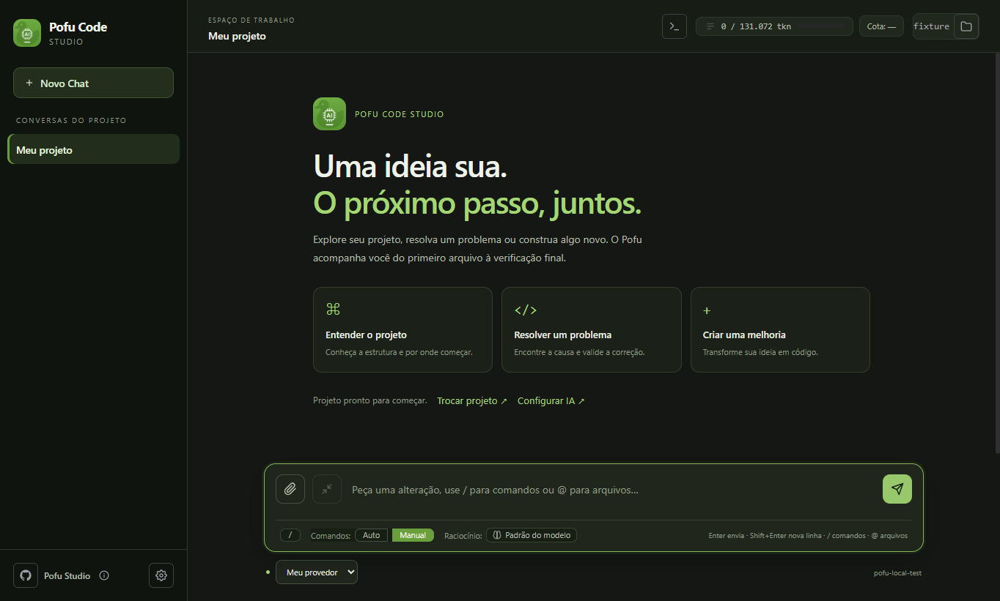
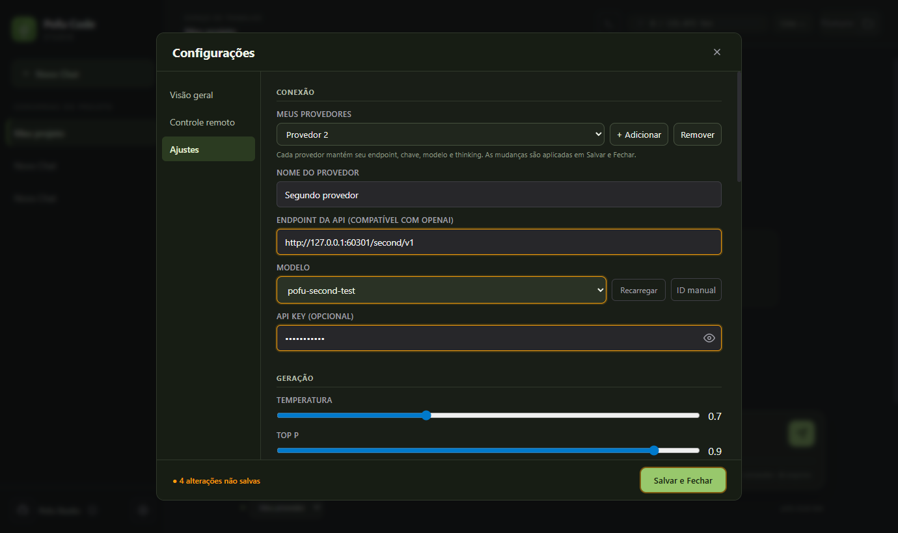
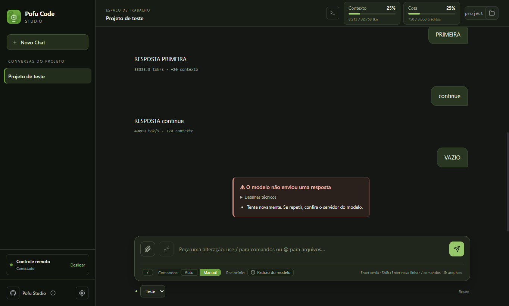
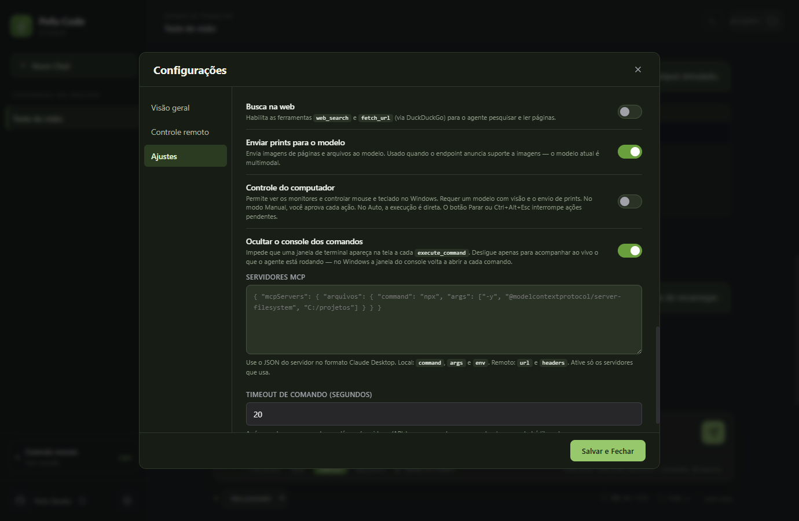

<!-- SPDX-License-Identifier: Apache-2.0 -->
<!-- Copyright 2026-present the Pofu Code Studio authors. All rights reserved. -->

# Pofu Code Studio

Um agente de código no desktop, com a identidade Pofu e o modelo que você escolher. Converse sobre o projeto, peça alterações e acompanhe a leitura dos arquivos, a execução dos comandos e os diffs no mesmo lugar.

O Studio conecta-se a **APIs compatíveis com OpenAI**, incluindo servidores locais como llama.cpp, Ollama e vLLM. O modelo precisa oferecer chamadas de ferramenta (*function calling*); recursos visuais também exigem um modelo multimodal.

[Baixar instaladores](https://github.com/Dspofu/Pofu-Code-Studio/releases/latest) · [Novidades da 1.6.0](docs/releases/v1.6.0.md) · [Guia de consumo e controle remoto](docs/consumo-remoto.md)



## O que você pode fazer

| Recurso | No seu trabalho |
|---|---|
| Conversas por projeto | Alterne entre chats e pastas recentes, mantendo o histórico de cada conversa. |
| Edição de código | Leia e pesquise arquivos, consulte funções e classes, aplique alterações e revise o diff com opção de desfazer. |
| Terminal e processos | Execute testes, acompanhe servidores e watchers e consulte a saída de tarefas demoradas. |
| Pesquisa e páginas web | Busque informações, leia páginas e capture a interface para conferir o resultado. |
| Imagens e arquivos | Cole ou arraste anexos; use `@` para mencionar arquivos do projeto. |
| Provedores e raciocínio | Salve conexões independentes e ajuste o modelo e o raciocínio pelo compositor. |
| Consumo | Veja tokens e, quando a API informa, cota ou saldo ao lado do uso de contexto. |
| Controle remoto | Continue a conversa e controle tarefas pela área Code do site, com as ferramentas executando no computador. |
| MCP e skills | Acrescente ferramentas de servidores MCP e instruções próprias para o agente. |

## Instalação

### Usar um instalador

Abra a página de [releases](https://github.com/Dspofu/Pofu-Code-Studio/releases/latest) e escolha o arquivo do seu sistema. Os instaladores incluem o runtime do aplicativo; não é necessário instalar Node.js separadamente.

| Sistema | Arquivo | Instalação |
|---|---|---|
| Windows | `.exe` | Execute o instalador e escolha a pasta de destino. |
| Ubuntu / Debian | `.deb` | `sudo apt install ./NOME_DO_ARQUIVO.deb` |
| Fedora | `.rpm` | `sudo dnf install ./NOME_DO_ARQUIVO.rpm` |

Nos comandos Linux, substitua `NOME_DO_ARQUIVO` pelo nome do pacote baixado. O pipeline publica esses três formatos; não há instalador macOS nesse fluxo.

### Executar a partir do código

Use Node.js 22 ou superior e npm. O CI usa Node.js 22; a versão 1.6.0 também foi validada localmente com Node.js 24.

```bash
git clone https://github.com/Dspofu/Pofu-Code-Studio.git
cd Pofu-Code-Studio
npm ci
```

No Linux:

```bash
npm start
```

No Windows:

```bash
npm run build
npx electron .
```

Execute os comandos dentro da pasta `Pofu-Code-Studio`, onde está o `package.json`. O script `npm start` compila antes de abrir o aplicativo e inclui opções específicas do Linux.

## Começar a usar

1. Abra **Configurações → Ajustes → Meus provedores** e informe o endereço da sua API, a chave se necessária e o modelo.
2. Clique em **Recarregar** para consultar os modelos. Se a API não oferecer essa listagem, use **ID manual**.
3. Clique em **Salvar e Fechar**. Cada perfil mantém sua conexão e seu modelo; o seletor abaixo do compositor alterna entre eles.
4. Clique em **Abrir projeto** e escolha a pasta em que o agente vai trabalhar.
5. Envie um pedido, por exemplo: “Revise esta API, corrija o erro de autenticação e execute os testes relevantes”.

O endereço é o endpoint compatível com OpenAI, geralmente terminado em `/v1`. Use o endereço e a porta do seu servidor. **Recarregar** já testa os valores digitados, mas as alterações só são gravadas em **Salvar e Fechar**.

<details>
<summary>Ver as configurações de provedor</summary>



</details>

### Durante a conversa

- Acompanhe os cards das ferramentas, os resultados e os diffs. **Desfazer** reverte a alteração no arquivo.
- Digite enquanto o agente trabalha: a mensagem entra na fila e é entregue na próxima etapa, após a ferramenta em execução terminar.
- Use **Parar** para interromper a geração. O painel de processos permite acompanhar ou encerrar tarefas em segundo plano.
- Digite `@` para mencionar um arquivo; caminhos com espaços são preenchidos com aspas. O clipe, arrastar e colar adicionam anexos.
- Ajuste **Auto/Manual** e **Raciocínio** junto ao compositor. A troca de provedor fica bloqueada durante a geração.

O nível de raciocínio usa as capacidades anunciadas pelo servidor. Quando elas não estão disponíveis, o menu oferece os níveis para você escolher; se a API recusar um ajuste, o Studio tenta uma alternativa indicada pelo erro ou reenvia sem esse ajuste.

## Consumo ao lado do contexto

Contexto e cota aparecem como anéis discretos abaixo da caixa de mensagem, ao lado do modelo, com percentual e valores; clique na cota para ver o consumo. Sem relatório da API, a cota aparece como não informada.

Clique na **cota no cabeçalho**, ao lado do uso de contexto, ou digite `/consumo`, `/usage` ou `/cost`. O resumo segue o provedor ativo, sem exigir outro endereço de API ou uma aba de consumo nas configurações.


O Studio identifica relatórios compatíveis pelo endpoint. A integração inclui Pofu Server, OpenRouter, DeepSeek, OpenAI, Anthropic e APIs próprias com o contrato `ai-usage/v1`. Cada provedor informa dados diferentes: saldo, limite da chave, ciclo ou custos. Relatórios de organização de OpenAI e Anthropic exigem credenciais administrativas específicas.

Quando não há relatório remoto acessível, fica disponível o **registro local** das chamadas do agente que retornam `usage`. Ele separa perfil, endpoint e chave; não inclui chamadas de outros aplicativos nem equivale à fatura inteira. Valores indisponíveis não são apresentados como saldo ou custo confirmado.

[Veja os relatórios, as credenciais aceitas e os limites de cada integração](docs/consumo-remoto.md).



Falhas transitórias aguardam **10 segundos** antes da próxima tentativa, com contagem regressiva e botão para cancelar. Erros mostram orientação e detalhes técnicos recolhidos. Pedidos enviados no encerramento do turno, como “continue”, seguem pela fila automaticamente.

## Controle remoto pelo site

Continue a conversa pela área **Code** do site, inclusive no celular. O Studio permanece aberto no computador, onde o projeto e as ferramentas continuam executando.

1. No site, entre na sua conta e abra **Code → Conectar computador**. O código aparece automaticamente.
2. Na lateral do desktop, clique em **Controle remoto → Ligar** e informe a origem HTTPS do site e o código.
3. Conecte e mantenha o Studio aberto. O código é de uso único e vence em cinco minutos.

A lateral tem um único botão **Ligar/Desligar**, com ponto verde e “Conectado” quando a ponte está ativa. Sem pareamento, Ligar abre a configuração. Em falha, mostra o tempo até reconectar. Cota e contexto seguem o visual da página Code, com anéis discretos e percentuais.

**O pareamento conecta uma instalação do Studio à sua conta, não uma API.** Um computador pode ter vários perfis de provedor e usar a mesma conexão remota. Outro computador precisa de seu próprio pareamento.


Pelo site você pode conversar, enviar mensagens à fila, interromper a geração, responder perguntas, aprovar ou recusar ferramentas e consultar consumo. Com o agente parado, pode gerenciar chats e trocar projeto conhecido, provedor, raciocínio e modo de execução.

Chaves das APIs não são enviadas ao site. A credencial de pareamento é protegida pelo cofre do sistema. **Desligar** no desktop pausa a ponte; **Desconectar** no site revoga a conexão.

Na revisão de código atual, o site também edita/apaga/regenera mensagens, duplica/limpa conversas, recebe imagens e mostra diferenças/desfaz alterações por snapshots. O menu `/` inclui processos e compactação. Até três PNG/JPEG/WebP chegam ao modelo com visão e permanecem anexadas no desktop. Ações respeitam execução, histórico atual e permissões do plano; editar/regenerar não desfaz ferramentas anteriores.

O espelho inclui os últimos 80 blocos/60 mil caracteres, nomes e miniaturas; o histórico completo permanece no desktop. Exportação baixa somente esse trecho. Arquivos gerais e abertura de pastas novas continuam no PC. API/site precisam estar atualizados e o Studio reaberto para as novas capacidades. Esta revisão ainda não tem novo instalador publicado.

## Comandos com `/`

Digite `/` no início da mensagem ou clique no botão `/` do compositor. Use ↑/↓ para escolher, **Enter** para executar, **Tab** para completar e **Esc** para fechar. **Shift+Enter** insere uma nova linha.

| Comando | Ação |
|---|---|
| `/ajuda` | Mostra os comandos disponíveis. |
| `/novo` | Cria uma conversa no mesmo projeto. |
| `/projeto` | Abre a seleção de pastas e projetos recentes. |
| `/config` / `/modelo` | Abre configurações ou seleção de modelo. |
| `/consumo` / `/usage` / `/cost` | Consulta o consumo do provedor ativo. |
| `/compactar` | Libera contexto sem apagar o histórico. |
| `/processos` / `/parar` | Acompanha processos ou interrompe a geração. |
| `/planejar`, `/revisar`, `/testar`, `/explicar` | Prepara um pedido no campo, para revisar antes de enviar. |

Exemplo: `/revisar src/main.ts` prepara uma revisão desse arquivo. Comandos locais não geram uma chamada ao modelo; pedidos preparados só são enviados quando você confirma a mensagem. Aliases em inglês, como `/help`, `/new` e `/review`, também funcionam.

## Ferramentas do agente

| Ferramenta | Função |
|---|---|
| `list_files` | Lista arquivos e pastas, com filtro glob e opção recursiva. |
| `read_file` | Lê o arquivo ou um trecho; aceita consulta direta e cursor de continuação. |
| `read_tool_result` | Recupera saídas grandes por cursor ou termo, sem repetir a operação. |
| `search_files` | Busca texto ou regex com paginação, filtros e linhas de contexto. |
| `list_definitions` | Mostra funções, classes, métodos e tipos com suas linhas. |
| `write_file` / `edit_file` | Cria arquivos ou aplica alterações; edições em lote são atômicas. |
| `create_directory` / `delete_file` | Cria pastas ou remove arquivos. |
| `execute_command` | Executa comandos no projeto e acompanha o início de processos. |
| `wait_for_process` / `read_process_output` | Aguarda tarefas demoradas e consulta sua saída. |
| `list_processes` / `stop_process` | Lista ou encerra processos acompanhados pelo Studio. |
| `http_request` | Consulta APIs com status, cabeçalhos e corpo separados. |
| `capture_page` | Renderiza uma página, captura a imagem e informa erros de console/rede. |
| `view_image` | Abre imagens do projeto e envia os pixels ao modelo com visão. |
| `capture_screen` | Captura um monitor real e informa as dimensões para interação. |
| `computer_action` | Usa mouse e teclado no Windows e devolve uma nova captura após a ação. |
| `web_search` / `fetch_url` | Pesquisa na web e extrai o conteúdo de páginas. |
| `ask_user` | Pede uma escolha ou esclarecimento e aguarda sua resposta. |
| `mcp__servidor__ferramenta` | Executa ferramentas dos servidores MCP configurados. |

### Imagens e controle do computador

O envio de imagens reconhece tanto `capabilities` quanto as modalidades de entrada anunciadas pelo endpoint, incluindo `architecture.input_modalities` do llama.cpp. `view_image` abre imagens dentro do projeto e guarda uma cópia da versão observada; os pixels seguem pelo mesmo fluxo dos anexos e prints de páginas.

Para interagir com programas do PC, ative **Configurações → Ajustes → Ferramentas → Controle do computador**, com **Enviar prints para o modelo** ligado e um modelo que anuncie visão. A opção começa desligada. `capture_screen` informa os monitores e um `screenshot_id`; o agente usa as coordenadas da imagem para clicar, mover o ponteiro, rolar, digitar texto Unicode ou acionar atalhos. Mouse e teclado estão implementados para **Windows**; a captura depende das permissões de tela do sistema.

Cada captura autoriza uma ação durante dois minutos. Depois, a ferramenta devolve outra imagem para conferir o resultado. No modo **Manual**, ações de mouse e teclado pedem aprovação; no **Auto**, executam diretamente. Use **Parar** ou **Ctrl+Alt+Esc** para interromper uma ação pendente. O controle do computador alcança programas fora da pasta do projeto.



### MCP, instruções e skills

Em **Configurações → Ajustes → Ferramentas → Servidores MCP**, cole a configuração do servidor. São aceitos processos locais por stdio e servidores remotos por Streamable HTTP:

```json
{
  "mcpServers": {
    "arquivos": {
      "command": "npx",
      "args": ["-y", "@modelcontextprotocol/server-filesystem", "C:/projetos"]
    },
    "remoto": { "url": "https://exemplo.com/mcp" }
  }
}
```

O estado e o custo estimado das definições de ferramentas aparecem na configuração. `"disabled": true` desliga um servidor sem removê-lo; processos locais precisam ter seu comando disponível no sistema.

Em **Instruções do agente**, acrescente regras próprias ao prompt ou importe arquivos de skills. Skills ativas são enviadas em cada requisição, com o custo estimado mostrado na lista. Substituir o prompt padrão também substitui as orientações de fábrica.

## Contexto, execução e dados

Arquivos e resultados grandes usam leitura por trecho e referências recuperáveis. A compactação encurta resultados antigos **no envio ao modelo**, preservando o histórico local. **Teto de histórico por requisição** permite limitar o contexto reenviado em APIs pagas. Um teto menor que o necessário pode provocar releituras.

O agente consulta a estrutura de arquivos de código grandes antes de ler tudo, evita releituras sem mudanças e interrompe chamadas repetidas com o mesmo resultado. Busca, listagem e saída de terminal usam formatos compactos. As medições dependem do projeto, do modelo e do servidor: em uma sessão documentada, o teto de 64 mil tokens reduziu o uso de prompt em 19%; isso não é uma previsão de economia para qualquer tarefa.

No modo **Manual**, comandos, exclusões, ações no computador, requisições HTTP com alteração e ferramentas MCP que não declaram somente leitura pedem aprovação. Ferramentas de arquivo verificam os caminhos do projeto, e sobrescrever um arquivo exige leitura prévia sem mudança posterior no disco. Terminal e servidores MCP executam com as permissões do sistema; a pasta do projeto não é um sandbox para esses processos.

Histórico e configurações ficam em `app-store.json`, no diretório de dados do Electron. Consumo local fica em `consumo.json`; prints e pontos de restauração ficam em `screenshots/` e `instantaneos/`. Bibliotecas da interface são incluídas em `vendor/`, sem depender de CDN; chamadas à IA e serviços externos dependem da conexão configurada.

## Desenvolvimento

O aplicativo usa Electron, TypeScript e DOM direto. A fonte vive em `src/`; o build gera `out/`, que não é versionado. `index.html` e `assets/studio.css` compõem a interface. O mapa detalhado está em [AGENTS.md](AGENTS.md) e as convenções em [CLAUDE.md](CLAUDE.md).

| Comando | Finalidade |
|---|---|
| `npm run build` | Compila e copia o módulo de pesquisa para `out/`. |
| `npm run typecheck` | Verifica os tipos sem emitir arquivos. |
| `npm test` | Executa os testes de unidade, incluindo consumo e controle remoto. |
| `npm run test:integration` | Exercita preload, ferramentas e interface no Electron com perfil isolado. |
| `npm run test:reconnect` | Verifica espera real de 10 segundos, cancelamento, medidores, status remoto e “continue” durante o salvamento. |
| `npm run test:consumption` | Testa o painel e os IPCs de consumo com dados sintéticos. |
| `npm run test:startup` | Verifica os avisos de atualização em diferentes cenários. |
| `npm run dist:win` | Gera o instalador Windows. |
| `npm run dist:linux` | Gera o pacote Ubuntu/Debian. |
| `npm run dist:fedora` | Gera o pacote Fedora; exige `rpmbuild`. |

`npm run test:api` e `npm run test:agent` fazem chamadas reais e são opcionais. Use `POFU_TEST_API_URL`, `POFU_TEST_API_KEY` e, se necessário, `POFU_TEST_MODEL` no ambiente; não grave credenciais no repositório. `POFU_QA_OUTPUT` define a pasta das capturas reais do teste de integração.

O workflow de [release](.github/workflows/release.yml) gera os instaladores ao receber uma tag `vX.Y.Z`. A tag deve corresponder à versão em `package.json`. A versão 1.6.0 mantém a pesquisa estável anterior; o protótipo de pesquisa web em revisão não integra esse release.

As imagens deste README foram capturadas no aplicativo e no site reais, com contas, projetos e respostas sintéticos em ambientes isolados.

## Licença e créditos

[Apache License 2.0](LICENSE). Consulte também o [NOTICE](NOTICE), com avisos e bibliotecas de terceiros. Ao redistribuir, preserve os avisos exigidos pela licença e sinalize os arquivos alterados.

Criado por **Dspofu**. Ícone do aplicativo gerado com ChatGPT; referências de ícones: [Feather](https://feathericons.com).
