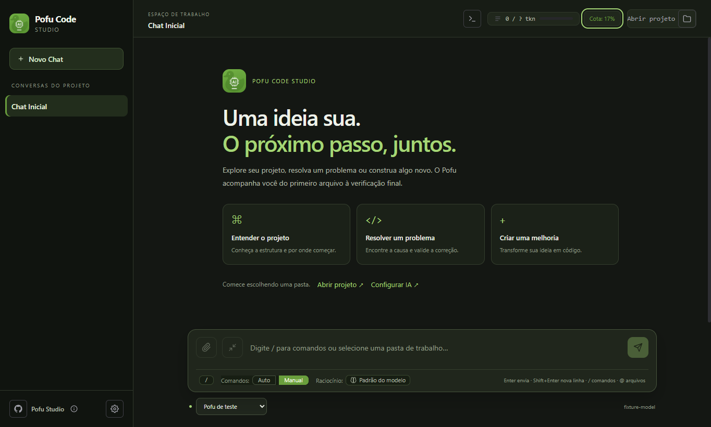
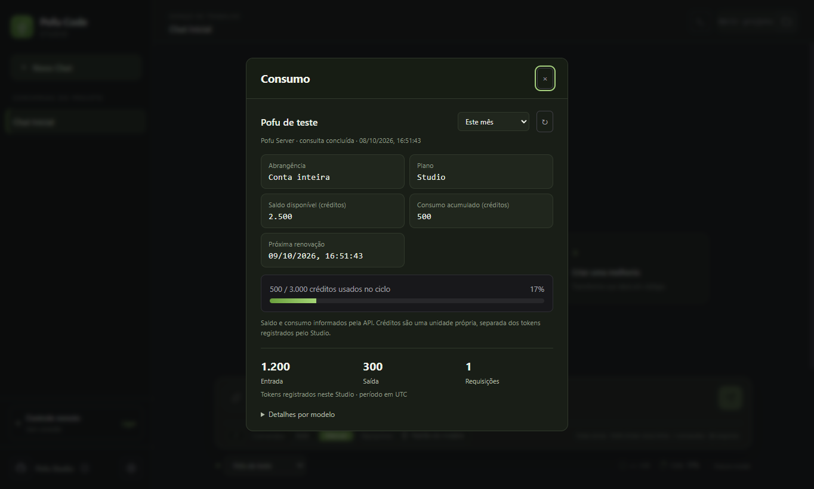
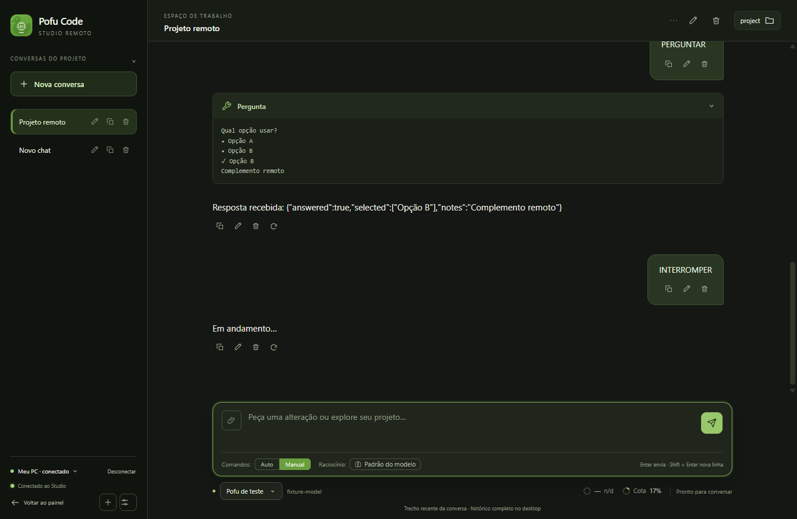
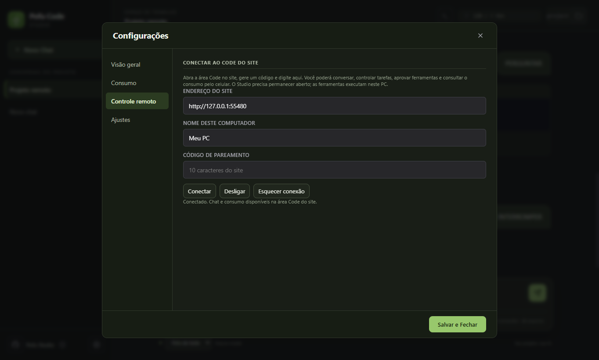

# Consumo e controle remoto

Clique no consumo no cabeçalho do chat, ao lado do contexto ou use `/usage`. O resumo usa automaticamente o provedor ativo e permite escolher o período. Saldo e ciclo aparecem quando a API os informa; detalhes por modelo ficam recolhidos. Trocar chave/endpoint separa o registro; reabrir preserva totais em `consumo.json`, sem mensagens/chaves. Contabiliza chamadas do agente com `usage` válido, por dia/modelo, até 366 dias. Chamadas externas e respostas sem `usage` não são contadas; não representa a fatura inteira.

| Provedor | Relatório | Credencial |
|---|---|---|
| OpenAI | Completions e custos da organização | Chave administrativa separada |
| Claude / Anthropic | Mensagens e custos da organização | Chave administrativa e acesso ao Admin API |
| OpenRouter | Uso acumulado/mensal e limite da chave | Chave comum |
| DeepSeek | Saldo por moeda | Chave comum |
| Pofu Server | `/v1/usage`: saldo/ciclo/plano em créditos | Chave comum |
| API própria/compatível | Endpoint da API + `/usage`, `schema: "ai-usage/v1"` | Chave comum |

OpenAI/Anthropic não oferecem fatura universal com qualquer chave de chat. Sem credencial administrativa previamente salva, o resumo mostra o registro local. Credenciais administrativas existentes são preservadas no cofre do sistema, usadas somente no host HTTPS oficial, fora do payload do modelo. Sistema sem cofre seguro não salva credenciais administrativas/pareamento. OpenRouter informa limite restante da chave, não saldo total da conta; DeepSeek informa saldo, sem histórico de gastos. Falhas e relatório parcial aparecem explicitamente, sem fabricar saldo/custo.

Referências: [OpenAI Admin APIs](https://developers.openai.com/api/docs/guides/admin-apis), [Anthropic Usage and Cost](https://platform.claude.com/docs/en/manage-claude/usage-cost-api), [OpenRouter Key](https://openrouter.ai/docs/api/api-reference/api-keys/get-current-api-key), [DeepSeek Balance](https://api-docs.deepseek.com/api/get-user-balance/).

## Code pelo site

Abra **Code → Conectar computador** no site atualizado; o código aparece automaticamente. No Studio, **Configurações → Controle remoto**: origem HTTPS do site e código (vence em cinco minutos). Mantenha o Studio aberto. Não é necessário abrir porta no PC.

Pelo site, converse com o agente, acompanhe resposta/ferramentas, envie à fila, pare geração, aprove/recuse ferramentas e responda perguntas. Crie/selecione/renomeie/apague chats e troque projeto conhecido, provedor, thinking ou modo de execução com agente parado. As ferramentas e proteção manual continuam no PC. Escolher automático no site exige confirmar que vale também no desktop.

Consumo aparece na mesma área Code: consulta ao conectar, a cada minuto e no botão Atualizar. Chaves comuns/administrativas e endpoint não vão ao site. Desligar no desktop pausa; desconectar no site revoga. Aplicativo retoma a conexão pareada ao abrir até desligar/revogar.

Revisão de código de 07/10: o site edita/apaga/regenera mensagens, duplica/limpa/exporta trecho de chats e oferece comandos `/`, processos e compactação. Apagar remove também as mensagens seguintes para preservar sequência das ferramentas. Editar preserva anexos; reenviar/regenerar descarta o ramo com confirmação. Diff/desfazer usa snapshots da conversa e restaura sobre o estado atual do arquivo, com confirmação. Projetos/provedores novos seguem cadastrados no desktop.

Até três PNG/JPEG/WebP podem ser escolhidas/coladas/arrastadas, normalizadas e salvas pelo IPC existente. Modelo com visão obrigatório; pixels vão à inferência e espelho devolve só nomes/miniaturas. Texto segue limitado aos últimos 80 blocos/60 mil caracteres; exportação baixa esse trecho. Sem conexão, comandos novos são recusados; consumo pode estar desatualizado (data acompanha relatório). Comando expirado/reinício não é reproduzido automaticamente. Imagens/processos/desfazer e computadores são gerenciados por plano no servidor.

Necessários API/site compatíveis e reabrir Studio atualizado. Não há novo instalador/release desta revisão. Passaram 90 testes Studio, 15 backend e 22 de integração site/IPC/agente em perfil, workspace e inferência sintéticos; nenhum processo de produção controlado.

## Desenvolvimento

`consumption.ts`: provedores/caches/moedas/escopo/paginação, deadline e redirecionamento proibido. `consumption-store.ts`: registro atômico. `consumption-vault.ts`: administrativa protegida. `remote-control.ts`: HTTPS no main. Renderer/preload compartilham exclusivamente espelho/comandos/resultados.

`npm test` inclui contratos/persistência da ponte e consumo. `npm run test:consumption` verifica painel/IPC reais com dados sintéticos. Após build, executar da raiz do saas: `node bench/bench-remote-code.ts --desktop` (API, proxy, Electron, contas e workspace isolados; inferência sintética). Não usa produção ou contas reais dos provedores.

Versão 1.6.0: API e site compatíveis já publicados; instale o desktop atualizado para parear. O protótipo de pesquisa web permanece local, fora deste release, em revisão após o comparativo. A pesquisa distribuída mantém a implementação estável anterior.

O endereço da API é único. Consumo usa o provedor ativo automaticamente, sem aba nas configurações e sem URL extra. O botão no cabeçalho, ao lado do contexto, abre um resumo compacto; `/usage`, `/cost` e `/consumo` abrem o mesmo resumo. Detalhes por modelo ficam recolhidos. APIs sem relatório remoto mostram somente o registro local, sem cartão de saldo desconhecido.
