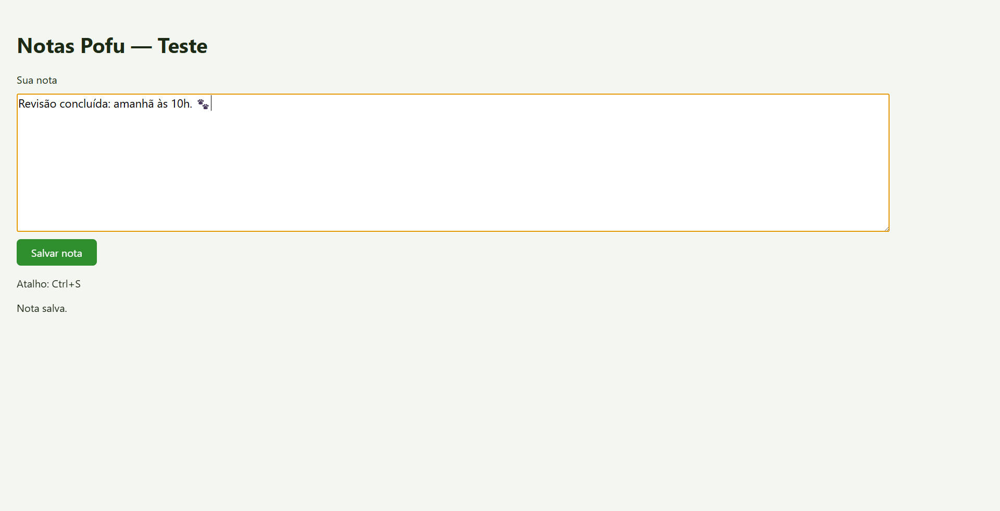

# Controle da máquina — 08/10/2026

Reteste no Windows com `http://localhost:5001/v1` e o modelo Qwen3.8-27B-NVFP4-Q5K-mtp-yarn1m. Os seis cenários passaram com decisões da IA, raciocínio configurado em Baixo e input nativo. A credencial não faz parte deste relatório.

Foram usados o app Electron, o loop do agente e os handlers nativos existentes. As tarefas ficam em duas janelas temporárias: uma página com formulário e o editor Notas Pofu. Os resultados são conferidos pelo estado dessas janelas e pelo conteúdo do arquivo salvo.

| Tarefa | Reteste com IA | Verificação nativa sem modelo |
|---|---|---|
| Clicar uma vez em Confirmar | Passou em 22 segundos | Passou |
| Digitar Pofu 2026 e pressionar Enter | Passou em 37 segundos | Passou |
| Marcar Aceito os termos | Passou em 17 segundos | Passou |
| Rolar e clicar em Fim da página | Passou em 27 segundos | Passou |
| Abrir Notas Pofu, escrever duas linhas e salvar | Passou em 87 segundos | Passou |
| Substituir a nota com Ctrl+A e salvar com Ctrl+S | Passou em 51 segundos | Passou |

Os cenários com IA somaram 241 segundos, 29 requisições HTTP, 17 ações nativas e 23 capturas reais. Todas as requisições responderam HTTP 200. Todas as ações e capturas foram bem-sucedidas, sem erros de ferramenta nem tempo esgotado. A nota salva foi comparada com o texto esperado nas duas etapas, incluindo acentos, quebra de linha e emoji. Cada tarefa enviou imagens ao modelo e usou ações nativas.

As janelas pertencem ao aplicativo de teste. O resultado cobre esse fluxo com duas janelas, sem afirmar compatibilidade com todos os aplicativos instalados.

O diagnóstico nativo executou 16 ações de mouse/teclado e 18 capturas reais, todas bem-sucedidas. Conferiu acentos, quebra de linha e o emoji 🐾 no texto salvo. As coordenadas desse diagnóstico vêm da própria janela de teste. Ele não valida as decisões do modelo.

## Falha na primeira tentativa

`/health` respondeu HTTP 200, mas a geração deixou de avançar. O slot 1 permaneceu na tarefa 2484, com `n_decoded: 0`, durante observações sucessivas. Um pedido sem imagem, “Responda apenas OK.”, com limite de 32 tokens e raciocínio desabilitado, também expirou após 20 segundos.

No ensaio anterior do editor, a instrumentação registrou uma requisição enviada e nenhuma resposta. Não ocorreu captura nem input nesse ensaio. A primeira tentativa de digitação chegou a preencher o campo, mas não enviou o formulário dentro de 600 segundos.

Antes do reteste, o pedido curto voltou a responder “OK” em aproximadamente 1,1 segundo. A execução completa seguinte passou nos seis cenários. A causa do travamento anterior da API não foi identificada por este teste.

## Ajustes feitos

- `capture_screen` aceita o nome `primary` usado espontaneamente pelo modelo. Outros IDs desconhecidos continuam recusados.
- As janelas de teste ficam maximizadas para cobrir outros aplicativos na captura.
- A chave fica na memória. Os handlers reais de persistência recebem apenas o sinalizador de permissão do computador.
- O relatório é salvo após cada tarefa e distingue requisições, respostas, ações nativas e imagens.
- Limite de tempo, seleção de tarefa e diagnóstico sem modelo podem ser escolhidos por variáveis de ambiente. O teste comum permanece sem input real.

Evidências: [reteste dos seis prompts com IA](controle-maquina-modelo-reteste.json), [diagnóstico nativo sem modelo](controle-maquina-nativo.json) e [falha anterior do editor](controle-maquina-modelo.json). O catálogo dos seis prompts está em [test-computador-real.cjs](../../scripts/test-computador-real.cjs).
